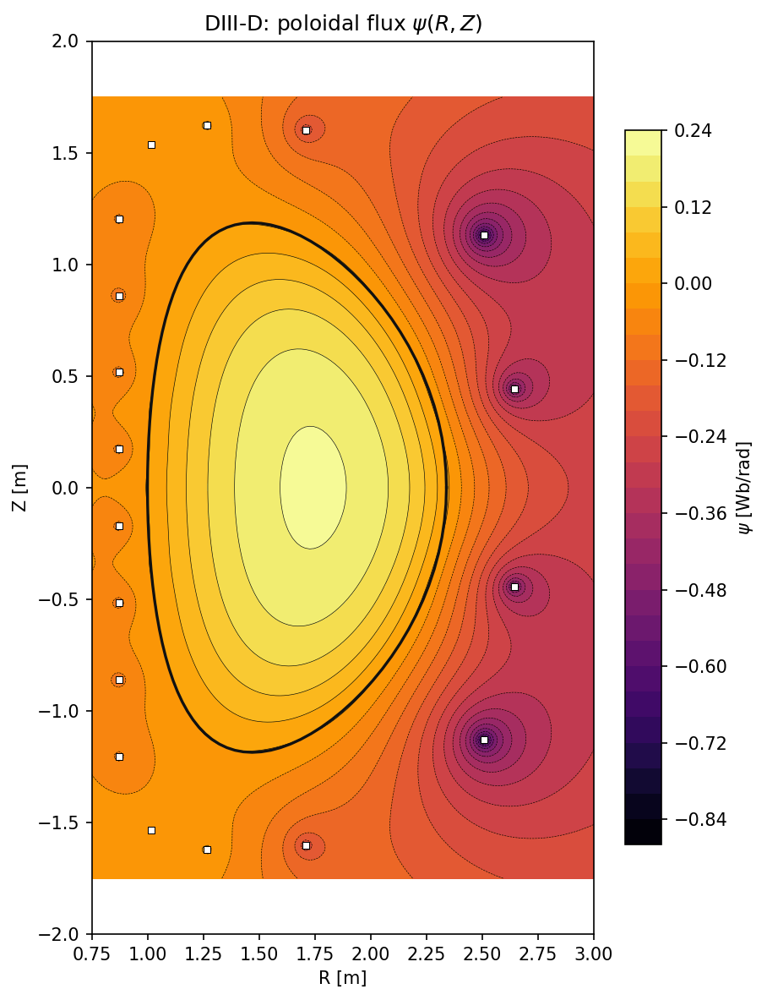
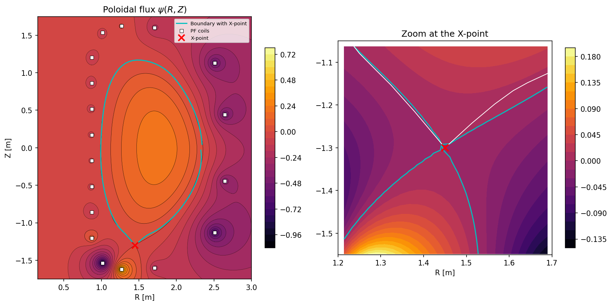

# Semi-free boundary equilibrium solver for tokamaks

A fast, parallel solver for the **semi-free boundary** problem of axisymmetric tokamak equilibria: given the
toroidal current density of the plasma $J_\phi(R,Z)$, a desired plasma boundary (smooth, or with one or more
X-points) and the positions of the poloidal-field (PF) coils, it computes the coil currents that sustain that
boundary and extends the solution to the vacuum region outside the plasma, returning the poloidal flux
$\psi(R,Z)$ and the magnetic field $B_R,\,B_Z$.

The problem is formulated with the Green functions of the toroidal elliptic operator $\Delta^*$ and solved as a
regularized least-squares problem (with exact equality constraints when X-points are prescribed). No iterative
relaxation over the whole domain is needed, and the evaluation of $\psi$ and $\mathbf{B}$ at each grid point is
independent of the others, which makes the code naturally parallel (OpenMP).

<p align="center">
  
</p>
<p align="center"><em>Poloidal flux &psi;(R,Z) for the DIII-D case (151x261 mesh, no X-point). The black curve is the
prescribed plasma boundary and the squares are the 18 PF coils.</em></p>

<p align="center">
  
</p>
<p align="center"><em>Solution with one X-point at (R, Z) = (1.45, -1.30) m: poloidal flux (left) and zoom around the
X-point (right).</em></p>

## Contents

- [How it works](#how-it-works)
- [Requirements](#requirements)
- [Quick start](#quick-start)
- [Usage in detail](#usage-in-detail)
- [Reproducing the validation studies](#reproducing-the-validation-studies)
- [Repository layout](#repository-layout)
- [Tests](#tests)
- [References](#references)
- [License](#license)

## How it works

Treating $J_\phi$ as a fixed source, the Grad-Shafranov equation becomes linear,
$\Delta^*\psi=-\mu_0 R J_\phi$, so the flux is a superposition of the plasma and coil contributions,

$$\psi(R_b,Z_b)=\underbrace{\int_{\Omega_p} J_\phi\,G^{\psi}\,dR\,dZ}_{\psi_p}+\underbrace{\sum_{i=1}^{N_c} I_i\,G^{\psi}(R_i,Z_i;R_b,Z_b)}_{\psi_c},$$

where $G^\psi$ is the Green function of $\Delta^*$ (expressed with complete elliptic integrals). The currents $I_i$
are the solution of

$$\min_I \;\lVert G\,I-r\rVert^2,\qquad r_j=\psi_{ref}-\psi_p(R_{b_j},Z_{b_j}),$$

over $N_b\gg N_c$ boundary points. The main numerical ingredients are:

- **Regularized SVD solution.** The matrix $G$ is severely ill-conditioned, so the problem is solved through its
  SVD (the normal equations are never formed) with Tikhonov regularization; the parameter is chosen
  automatically at the corner of the L-curve (or set manually in the configuration file).
- **X-points.** For each X-point the three conditions $B_R=0$, $B_Z=0$, $\psi=\psi_{ref}$ are imposed *exactly* as
  a linear constraint $C\,I=d$ and eliminated with the null-space method, which reduces the problem to an
  unconstrained one with the same solver.
- **Cut-Cell quadrature.** The plasma integral over the current-density grid uses a boundary-conforming quadrature
  of second order, $O(h^2)$, with a subtraction of the Green-function singularity.
- **Fast Green functions.** $K$ and $E$ are evaluated with the arithmetic-geometric-mean iteration (quadratic
  convergence), and the grid sweeps are parallelized with OpenMP.

## Requirements

- A C++11 compiler with OpenMP (`g++` recommended) and `make`.
- Python 3 with `numpy`, `scipy` and `matplotlib` for the analysis notebooks (already available on Google Colab);
  `pip install -r requirements.txt` installs them, plus `freegs` for notebooks 04 and 05.

Eigen and nlohmann/json are included in `src/third_party/`; nothing else has to be installed to build the solver.

## Quick start

```bash
git clone https://github.com/BecerraMiguel/SemiFree-Solver.git
cd SemiFree-Solver

make                                   # builds build/semifree_solver (with -fopenmp)

cd cases/DIII-D_82x142                 # run from inside a case directory
printf '../../configs/DIII-D_82x142.json\n0\n' | ../../build/semifree_solver
```

This solves the DIII-D case on the 82x142 mesh without X-points (the two lines piped to the solver are the
configuration file and the number of X-points). It takes about 4 minutes on a 2-core machine and writes the coil
currents to `corrientes.txt` and the flux to `psi_check.txt` (see [Outputs](#outputs)) in the case directory.
To keep `cases/` untouched, copy a case to a scratch folder two levels below the root (for instance `runs/<name>/`)
and run there, adjusting the relative paths.

Check that the executable was linked against OpenMP with `ldd build/semifree_solver | grep gomp`; without
`-fopenmp` the code still compiles but runs single-threaded. `make` always enables it. `make clean` removes the binary.

## Usage in detail

### Inputs

A run needs a configuration file (`configs/*.json`) and three text files in the working directory:

| File | Content |
|---|---|
| `Jt.txt` | Toroidal current density $J_\phi$ in A/m$^2$ on the computational mesh: `npz` rows by `npr` columns, whitespace-separated. |
| `Dshape.txt` | Desired plasma boundary, one `R Z` pair per line, in meters. |
| `coils.txt` | PF coil positions, one `R Z` pair per line, in meters. |

The names of these three files are set in the `files` block of the configuration file. Configuration example
(`configs/DIII-D_82x142.json`):

```json
{
  "name": "DIII-D_82x142",
  "geometry":    { "Ro": 1.67, "a": 0.67, "kappa": 1.77, "delta": 0.30 },
  "constraints": { "I_plasma": 1500000.0, "P_axis": 50000.0, "B_axis": 2.0, "Psi_b": 0.0 },
  "mesh":        { "r_min": 0.15, "r_max": 3.0, "z_min": -1.75, "z_max": 1.75, "npr": 82, "npz": 142 },
  "files":       { "Jt": "Jt.txt", "boundary": "Dshape.txt", "coils": "coils.txt" }
}
```

- `Ro` is the reference length used for the normalization and `I_plasma` the reference current; `Psi_b` is the
  flux value $\psi_{ref}$ imposed on the boundary.
- `mesh` describes the grid on which `Jt.txt` is given and on which the outputs are written.
- Optional field `"lambda"`: `"auto"` (default, L-curve corner) or a number to override the regularization parameter.

The five DIII-D meshes provided are 82x142, 100x172, 151x261, 213x368 and 301x521; they differ only in `npr` and `npz`.

### Running the solver

The executable must be launched **from inside a directory two levels below the repository root** (for example
`cases/<name>/`), because the input files are looked up by name in the current directory and some helper paths are
relative to that depth (`../../configs`, `../../build`, `../../src`). It reads its parameters from standard
input, so it can be used interactively or scripted:

| Prompt | Answer |
|---|---|
| Path to the configuration file | e.g. `../../configs/DIII-D_82x142.json` |
| Number of X-points $N_x$ | `0`, `1`, ... |
| For each X-point: $R$ and $Z$ | coordinates in meters (only if $N_x>0$) |
| Boundary transformation method | `0`-`3` (only if $N_x>0$), see below |

### Cases with X-points

For $N_x>0$ the solver imposes $B_R=B_Z=0$ and $\psi=\psi_{ref}$ at each X-point *exactly*. Every X-point has to lie
on the boundary, so the boundary must have a cusp there. There are two ways to provide it:

- **Boundary already has the cusp (recommended, used for the validation studies).** Provide a `Dshape.txt` that
  already contains the cusp and a `Jt.txt` consistent with it, enter the X-point position anyway, and choose
  transformation method **`0`**. Method 0 does not modify the boundary, but the position is still needed for the
  X-point constraints, and it **must coincide with the cusp vertex in your boundary file**; otherwise the
  constraints are imposed at a point that is not the vertex.
- **Let the solver deform a smooth boundary.** Methods `1` (multi-parameter adaptive), `2` (dual-parameter adaptive)
  and `3` (dual-parameter adaptive with a $C^1$ Bezier cusp, the recommended one) deform the boundary with the scripts
  in `src/semifree_boundary/xpoint_transform*.py` and then re-solve $J_\phi$ for the new boundary by calling
  `build/gs_solver_xpoint` (built from `src/grad_shafranov/main_xpoint.cpp`, see below). These methods rely on the
  two-levels-deep layout mentioned above. They are provided as a convenience; the validation studies use method `0`.

Every case directory in `cases/` ships both variants. `Dshape.txt`/`Jt.txt` are the smooth boundary and its current
density; `Dshape_xpoint.txt`/`Jt_xpoint.txt` are the boundary deformed to create an X-point at
$(R_X,Z_X)=(1.45,\,-1.30)$ m (the cusp vertex is exactly that point) and the current density consistent with it.
The solver reads the files named in the configuration, so to run the X-point variant use a separate directory
(the outputs share names with the smooth-boundary run):

```bash
mkdir -p runs/DIII-D_82x142_xpoint && cd runs/DIII-D_82x142_xpoint
cp ../../cases/DIII-D_82x142/Dshape_xpoint.txt Dshape.txt
cp ../../cases/DIII-D_82x142/Jt_xpoint.txt     Jt.txt
cp ../../cases/DIII-D_82x142/coils.txt         coils.txt
printf '../../configs/DIII-D_82x142.json\n1\n1.45\n-1.30\n0\n' | ../../build/semifree_solver
```

The answers piped above are: configuration file, one X-point, $R_X=1.45$, $Z_X=-1.30$, method `0`.

### Outputs

Written to the working directory (lengths in meters, currents in amperes, $\psi$ in Wb/rad, $B$ in tesla):

| File | Content |
|---|---|
| `corrientes.txt` | One line per coil: `R Z I`. |
| `psi_check.txt` | Total poloidal flux $\psi(R,Z)$ on the mesh (`npz` rows by `npr` columns). |
| `BR_check.txt`, `BZ_check.txt` | $B_R$, $B_Z$ on the mesh, from the closed-form Green functions. |
| `psi_boundary_check.txt` | $\psi$ evaluated exactly at every boundary point: `R Z psi psi_ref |psi-psi_ref|`. |
| `sample_points_check.txt` | $\psi$, $B_R$, $B_Z$ at a few fixed points (and at the X-points when $N_x>0$). |
| `regularization_diagnostics.txt` | Condition numbers, regularization parameter and its origin (and, with X-points, the rank of the constraint matrix and its residual). |
| `Jphi_check.txt` | The current density as read by the solver. |

`BR_check.txt` and `BZ_check.txt` are the two most expensive outputs. Note that near the plasma boundary
(inside it) the closed-form $G^{B_R},G^{B_Z}$ are singular enough to lose accuracy; **differentiating $\psi$**
($B_R=-\frac1R\partial_Z\psi$, $B_Z=\frac1R\partial_R\psi$) gives a smooth, divergence-free field and is the
recommended way to obtain $\mathbf{B}$.

### Cost

The final evaluation of $\psi$ (and of $B$) sums over the whole current-density grid for every output point, so its
cost grows like $N^2$ with $N=n_{pr}\,n_{pz}$. Reference times on a 2-core machine (Google Colab):

| Mesh | 82x142 | 100x172 | 151x261 | 213x368 | 301x521 |
|---|---|---|---|---|---|
| $N$ | 11,644 | 17,200 | 39,411 | 78,384 | 156,821 |
| Time through `psi_check.txt` | 0.6 min | 1.0 min | 2.9 min | 8.6 min | 28.6 min |
| Total, including $B_R$, $B_Z$ | 1.5 min | 2.5 min | 8.2 min | 25.6 min | 85 min |

The coil currents themselves are available almost immediately: they are computed before the field sweeps.

### Generating $J_\phi$

The current densities shipped in `cases/` were generated with the fixed-boundary Grad-Shafranov solver in
`src/grad_shafranov/` (`GS_solver.h` plus three small drivers); they are not needed to run the semi-free solver on the
provided cases. Should you want to build them:

```bash
g++ -O3 -fopenmp -Isrc/third_party -o build/gs_solver         src/grad_shafranov/main.cpp        -lm -std=c++11
g++ -O3 -fopenmp -Isrc/third_party -o build/gs_solver_poly    src/grad_shafranov/main_poly.cpp   -lm -std=c++11
g++ -O3 -fopenmp -Isrc/third_party -o build/gs_solver_xpoint  src/grad_shafranov/main_xpoint.cpp -lm -std=c++11
```

- `main.cpp` solves the analytic D-shape given by the `geometry` block of the configuration (it then runs a
  semi-free Grad-Shafranov step that reads `Results/corrientes.txt` from a previous semi-free run).
- `main_poly.cpp` solves for an arbitrary polygonal boundary (for example the boundary with an X-point): it
  prompts for the configuration file and for the polygon file (`R Z` per line). It expects a `Results/` directory in
  the working directory and writes `Results/Jt.txt`.
- `main_xpoint.cpp` is the same polygonal driver reading the polygon path from the configuration; it is the binary
  used by transformation methods `1`-`3` of the semi-free solver.

## Reproducing the validation studies

The `notebooks/` folder contains five self-contained Google Colab notebooks that reproduce the validation of the
solver on the DIII-D case. Each one clones this repository, builds the solver and runs everything from the
provided cases and configurations: nothing has to be uploaded. Expected results from earlier runs are printed next to
the computed ones.

| Notebook | Study | Estimated time (Colab) |
|---|---|---|
| [`01_physical_validation`](https://colab.research.google.com/github/BecerraMiguel/SemiFree-Solver/blob/main/notebooks/01_physical_validation.ipynb) | 151x261, no X-point: boundary residual, coil currents, $\psi$, $\mathbf{B}$ from Green functions and from $\partial\psi$, their difference and $\nabla\cdot\mathbf{B}$. | ~10 min |
| [`02_mesh_convergence_Nx0`](https://colab.research.google.com/github/BecerraMiguel/SemiFree-Solver/blob/main/notebooks/02_mesh_convergence_Nx0.ipynb) | Five meshes, no X-point: convergence order of $\psi$ (three regions) and of the coil currents, and run times. | ~45 min |
| [`03_mesh_convergence_Nx1`](https://colab.research.google.com/github/BecerraMiguel/SemiFree-Solver/blob/main/notebooks/03_mesh_convergence_Nx1.ipynb) | Same study with an X-point at $(1.45,-1.30)$, plus $\psi$, $B_R$, $B_Z$ at the X-point. | ~1 h |
| [`04_freegs_comparison_unsymmetrized`](https://colab.research.google.com/github/BecerraMiguel/SemiFree-Solver/blob/main/notebooks/04_freegs_comparison_unsymmetrized.ipynb) | Comparison against `freegs`, the free-boundary solver underlying FreeGSNKE, without imposing up-down symmetry: on most meshes the free-boundary iteration settles on a vertically displaced equilibrium. | ~3 h |
| [`05_freegs_comparison_symmetrized`](https://colab.research.google.com/github/BecerraMiguel/SemiFree-Solver/blob/main/notebooks/05_freegs_comparison_symmetrized.ipynb) | Same comparison enforcing $\psi(R,Z)=\psi(R,-Z)$: differences with respect to the semi-free solution and run times. | ~1.3 h |

Every notebook has a `QUICK_MODE` switch (three coarsest meshes only) and a `USE_GOOGLE_DRIVE` switch that keeps the
results in your Drive, so that finished runs are reused after a disconnection and shared between notebooks. Shared
helpers live in `notebooks/reproduce_common.py`. The notebooks can also be run locally (set the repository path in
the first cell).

## Repository layout

```
.
├── Makefile                    builds build/semifree_solver
├── cases/                      inputs of the five DIII-D meshes (Jt, boundary, coils; smooth and X-point variants)
├── configs/                    one JSON configuration per mesh
├── notebooks/                  Colab notebooks and the helper module they share
├── assets/                     images used in this README
└── src/
    ├── semifree_boundary/      the semi-free solver
    │   ├── SemiFree_Solver.cpp   main program
    │   ├── regularization.h      SVD, L-curve and null-space methods
    │   ├── cutcell_geometry.h, grid_jphi_reconstruction.h,
    │   │   singularity_kernels.h, singularity_subtraction.h,
    │   │   adaptive_quadrature.h   plasma-integral quadrature
    │   ├── xpoint_transform*.py  boundary transformations for X-points
    │   └── tests/                unit and regression tests (with Makefile and fixtures)
    ├── grad_shafranov/         fixed-boundary Grad-Shafranov solver and drivers (produces J_phi)
    ├── freegs_comparison/      profile translation used by the freegs comparison notebooks
    └── third_party/            Eigen and nlohmann/json
```

## Tests

The tests of the solver's building blocks (quadrature, Green-function kernels, regularization, null-space method,
...) live in `src/semifree_boundary/tests/` with their own `Makefile`; they read their data from
`tests/fixtures/`, so they do not depend on the rest of the repository.

```bash
make -C src/semifree_boundary/tests quick    # build and run the 6 fast tests (a few minutes to compile)
make -C src/semifree_boundary/tests test     # all 8 tests; two of them are slow (add TIMEOUT=600 to cap each run)
make -C src/semifree_boundary/tests run-cutcell_geometry   # a single test
```

## References

1. R. Farengo, P. L. Garcia-Martinez and H. E. Ferrari, *A simple and fast method to calculate the coil currents and
   the external poloidal flux and magnetic field for fixed boundary equilibria*, Plasma Science and Technology
   **26**(11), 115103 (2024).
2. N. C. Amorisco, A. Agnello, G. Holt, M. Mars, J. Buchanan and S. Pamela, *FreeGSNKE: A Python-based dynamic
   free-boundary toroidal plasma equilibrium solver*, Physics of Plasmas **31**(4), 042517 (2024),
   doi:[10.1063/5.0188467](https://doi.org/10.1063/5.0188467).
3. B. Dudson, *FreeGS: Free Boundary Grad-Shafranov Solver*, <https://github.com/freegs-plasma/freegs>.

## License

A license has not been assigned yet. Until one is added, all rights are reserved by the authors.
